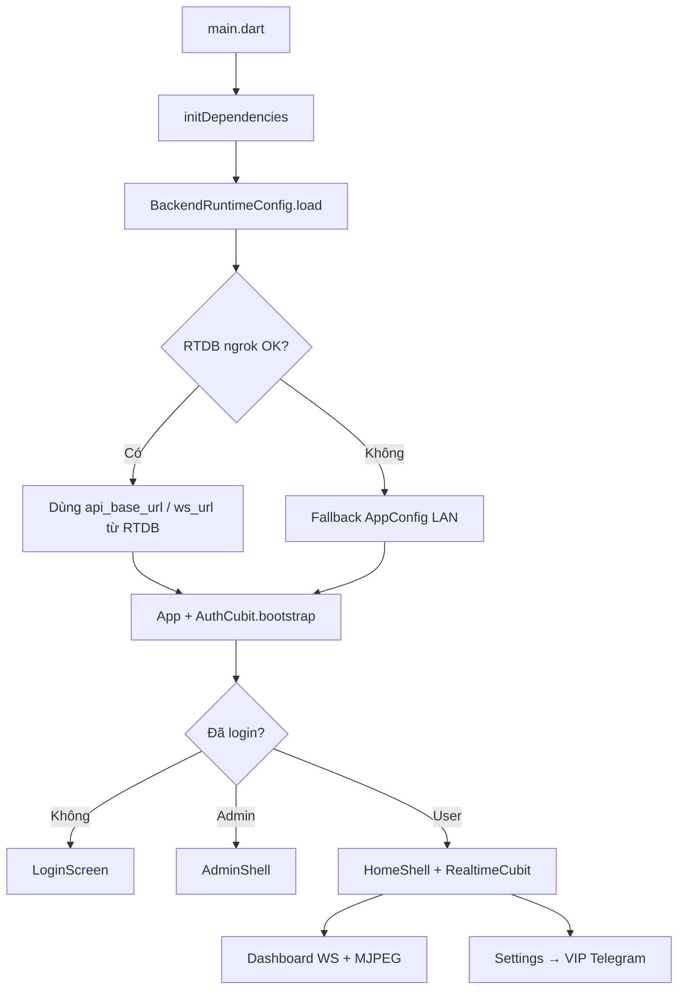

# Ai camcheck — Mobile (Flutter)

Ứng dụng **Ai camcheck** kết nối backend FastAPI: đăng nhập, chọn nguồn camera, MJPEG theo nguồn, phân tích/báo cáo theo từng nguồn, AI đọc log phát hiện, VIP nhiều camera chạy song song.

---

## Yêu cầu

| Công cụ | Phiên bản gợi ý |
|---------|------------------|
| Flutter SDK | `>=3.3.0` (xem `pubspec.yaml`) |
| Dart | đi kèm Flutter |
| Android Studio / Xcode | build thiết bị thật hoặc emulator |
| Backend | chạy tại `http://HOST:8000` hoặc URL ngrok từ Firebase RTDB |

---

## Chạy nhanh

```bash
cd mobile
flutter pub get
flutter run
```

### Trỏ backend khi dev (LAN)

```bash
flutter run --dart-define=BACKEND_HOST=192.168.1.9:8000
```

Hoặc đầy đủ:

```bash
flutter run \
  --dart-define=API_BASE_URL=http://192.168.1.9:8000/api/v1 \
  --dart-define=WS_URL=ws://192.168.1.9:8000/api/v1/ws
```

### Google Sign-In (tuỳ chọn)

```bash
flutter run --dart-define=GOOGLE_SERVER_CLIENT_ID=YOUR_WEB_CLIENT_ID
```

---

## Cấu trúc thư mục `lib/` (đã dọn)

```
lib/
├── main.dart                 # Entry: init DI → runApp(App)
├── app.dart                  # MaterialApp, auth gate, theme, routes
│
├── core/                     # Hạ tầng app (không phụ thuộc UI màn hình)
│   ├── app_config.dart       # URL mặc định theo platform (dart-define)
│   ├── backend_runtime_config.dart  # Đọc /backend.json từ Firebase RTDB
│   ├── auth/auth_styles.dart
│   ├── di/injection.dart     # GetIt: API, cubit, storage
│   ├── l10n/app_localizations.dart  # EN / VI
│   ├── routes/app_routes.dart       # Tất cả named routes
│   ├── storage/app_storage.dart     # Token, theme, locale (SharedPreferences)
│   └── theme/app_theme.dart
│
├── models/                   # DTO: UserProfile, Source, RealtimeStatus, ...
├── services/                 # REST / WS clients
│   ├── api_client.dart
│   ├── auth_api.dart
│   ├── admin_api.dart
│   ├── sources_api.dart
│   ├── monitoring_api.dart
│   ├── camera_api.dart
│   ├── realtime_stream.dart
│   ├── push_notification_service.dart
│   └── vip_upgrade_launcher.dart   # Mở Telegram @Codebox88
│
├── state/                    # BLoC / Cubit
│   ├── auth/
│   ├── selected_source/      # Nguồn đang xem (Home, AI, Analytics, …)
│   ├── app_settings_cubit.dart
│   ├── fall_detection/       # RealtimeCubit (màn Fall monitor)
│   └── camera_monitor/ (MJPEG + nguồn)
│
├── screens/                  # UI theo màn hình
│   ├── login_screen.dart, register_screen.dart, ...
│   ├── home_shell.dart       # User: Dashboard | Analytics | AI | Settings
│   ├── dashboard_screen.dart
│   ├── admin_shell.dart      # Admin: Overview | Users
│   └── ...
│
├── widgets/
│   ├── monitoring/           # Status, people list, connection badge, ...
│   └── safe_mjpeg_view.dart  # MJPEG an toàn (tránh socket loop)
│
└── utils/
    └── action_vote_buffer.dart
```

### Thư mục **không** nằm trong `lib/` (build / native)

| Thư mục | Mục đích |
|---------|----------|
| `android/`, `ios/`, `linux/`, `macos/`, `windows/` | Flutter platform embed |
| `build/`, `.dart_tool/` | Generated — **không commit** |
| `.gradle-home/` | Cache Gradle local — **đã xóa / ignore** |

---

## Luồng ứng dụng



1. **Khởi động**: `initDependencies()` đăng ký storage, đọc config backend (RTDB hoặc fallback LAN).
2. **Auth**: JWT lưu trong `CustomSharedPreferences`; refresh qua `AuthApi`.
3. **Phân quyền**:
   - `role == admin` → `AdminShell` (không đi luồng user).
   - User thường → `HomeShell` (4 tab).
4. **Nguồn đang xem**: `SelectedSourceCubit` (lưu `selected_source_id`) — chip trên Home đổi nguồn → MJPEG, status poll, history/reports/AI theo `source_id`.
5. **VIP**: bật nhiều nguồn trong `/sources`; Home hiển thị stream của nguồn đang chọn. Nâng cấp qua Telegram (`VipUpgradeLauncher`).

---

## Kết nối backend

### Thứ tự ưu tiên URL

1. Biến build `--dart-define=API_BASE_URL` / `WS_URL` (nếu set).
2. Firebase RTDB `.../backend.json` (ngrok do backend publish).
3. Health check `GET {api_base_url}/health` — fail thì fallback.
4. `AppConfig` (mặc định `10.0.2.2:8000` trên Android emulator).

Override URL config:

```bash
flutter run --dart-define=BACKEND_CONFIG_URL=https://YOUR_PROJECT.firebaseio.com/backend.json
```

### API chính (mobile gọi)

| Nhóm | Service | Ví dụ endpoint |
|------|---------|----------------|
| Auth | `AuthApi` | `/auth/login`, `/auth/me`, `/auth/refresh` |
| Sources | `SourcesApi` | `/sources`, activate source |
| Monitoring | `MonitoringApi` | `/monitoring/status`, `/history`, `/reports` |
| Admin | `AdminApi` | `/admin/users`, `/admin/stats` |
| Realtime | `RealtimeStream` | WebSocket `/api/v1/ws?token=...` |
| Stream | MJPEG URL từ `BackendRuntimeConfig` | `/streams/{id}/mjpeg` |

---

## Màn hình & điều hướng

### User (`HomeShell`)

| Tab | Screen | Ghi chú |
|-----|--------|---------|
| Home | `DashboardScreen` | Chip chọn nguồn, MJPEG + status theo nguồn, timeline/báo cáo |
| Analytics | `AnalyticsScreen` | Thống kê theo nguồn đang chọn |
| AI | `AiChatScreen` | Hỏi đáp theo log + nguồn đang chọn |
| Settings | `_SettingsPanel` | Theme, ngôn ngữ, lịch sử/báo cáo/chat, nguồn, VIP |

### Named routes (`AppRoutes`)

| Route | Màn hình |
|-------|----------|
| `/sources` | Quản lý nguồn video |
| `/history` | Lịch sử |
| `/reports` | Báo cáo |
| `/chat-history` | Lịch sử hội thoại AI |
| `/camera-monitor` | Giám sát camera + MJPEG |
| `/fall-detection` | Màn hình fall chi tiết |
| `/analytics` | Analytics (từ dashboard) |
| `/register`, `/forgot` | Auth phụ |

### Admin (`AdminShell`)

| Tab | Screen |
|-----|--------|
| Overview | `AdminOverviewTab` — stats users/sources |
| Users | `AdminUsersScreen` — list, filter, đổi plan/role, xóa user |

---

## State management

| Cubit | File | Trách nhiệm |
|-------|------|-------------|
| `AuthCubit` | `state/auth/` | Login, logout, bootstrap, `refreshProfile()` |
| `SelectedSourceCubit` | `state/selected_source/` | Nguồn focus toàn app (SharedPreferences) |
| `AppSettingsCubit` | `state/app_settings_cubit.dart` | Theme sáng/tối, locale EN/VI |
| `RealtimeCubit` | `state/fall_detection/` | WS (màn Fall monitor) |
| `CameraMonitorCubit` | `state/camera_monitor/` | Nguồn + stream panel |

**GetIt** (`core/di/injection.dart`): singleton cho API/config, factory cho cubit (mỗi lần mở route có thể tạo instance mới).

---

## Đa ngôn ngữ

- File: `core/l10n/app_localizations.dart`
- Keys dùng `loc.translate('key')`
- Hỗ trợ: `en`, `vi` — đổi trong Settings → `AppSettingsCubit`

---

## Thông báo & VIP

- **FCM**: `PushNotificationService` (cần cấu hình Firebase trên native).
- **VIP**: `VipUpgradeLauncher.openTelegramUpgrade()` → Telegram `@Codebox88`.
- Android: intent filter `https` / `tg` trong `AndroidManifest.xml`.

---

## Phân công 2 người (gợi ý)

| Người | Phạm vi trong `mobile/lib` |
|-------|----------------------------|
| **A** | `screens/` user flow, `dashboard`, `state/fall_detection`, `widgets/monitoring`, `realtime` |
| **B** | `screens/admin_*`, `services/admin_api`, `auth`, `core/l10n`, `settings`, `vip_upgrade` |

**File dùng chung — chỉ 1 người sửa / PR:** `app.dart`, `core/di/injection.dart`, `core/routes/app_routes.dart`.

---

## Scripts hữu ích

```bash
# Phân tích code
flutter analyze lib

# Build APK release
flutter build apk --dart-define=BACKEND_HOST=YOUR_IP:8000

# Dọn cache local
flutter clean
```

---

## Đã dọn trong đợt refactor này

- Xóa `mobile/.gradle-home/` (cache Gradle, không thuộc source).
- Xóa `lib/app_common_data/`, `lib/state/app_state.dart`, `lib/routes/app_router.dart` (trùng / không dùng).
- Gộp `main_development.dart` + `main_production.dart` → một `main.dart`.
- Đổi `shared_customization/` → `core/` (theme, l10n, storage, auth styles).
- Đổi `get_it_dependencies.dart` → `core/di/injection.dart`.
- Đổi `widgets/fall_detection/` → `widgets/monitoring/`.
- Gom route vào `core/routes/app_routes.dart` và gắn vào `MaterialApp.routes`.

---

## Liên quan repo

- Backend & pipeline AI: xem `../README.md` và `../BACKEND_CODE_ANALYSIS.md`.
- Cấu hình backend publish ngrok: `backend/app/services/config_publisher.py`.
